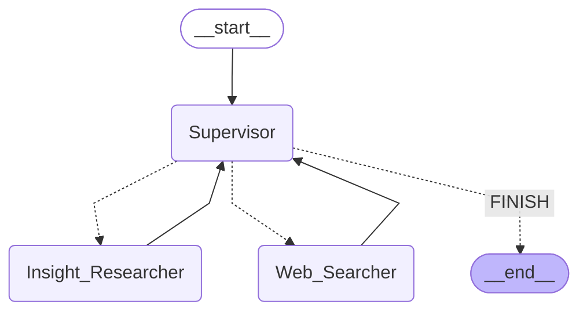

# Agent Graph Visualization

```mermaid
---
config:
  flowchart:
    curve: linear
---
graph TD;
	__start__([<p>__start__</p>]):::first
	Supervisor(Supervisor)
	Web_Searcher(Web_Searcher)
	Insight_Researcher(Insight_Researcher)
	__end__([<p>__end__</p>]):::last
	Insight_Researcher --> Supervisor;
	Supervisor -.-> Insight_Researcher;
	Supervisor -.-> Web_Searcher;
	Supervisor -. &nbsp;FINISH&nbsp; .-> __end__;
	Web_Searcher --> Supervisor;
	__start__ --> Supervisor;
	classDef default fill:#f2f0ff,line-height:1.2
	classDef first fill-opacity:0
	classDef last fill:#bfb6fc

```